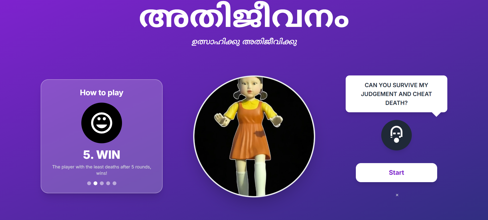
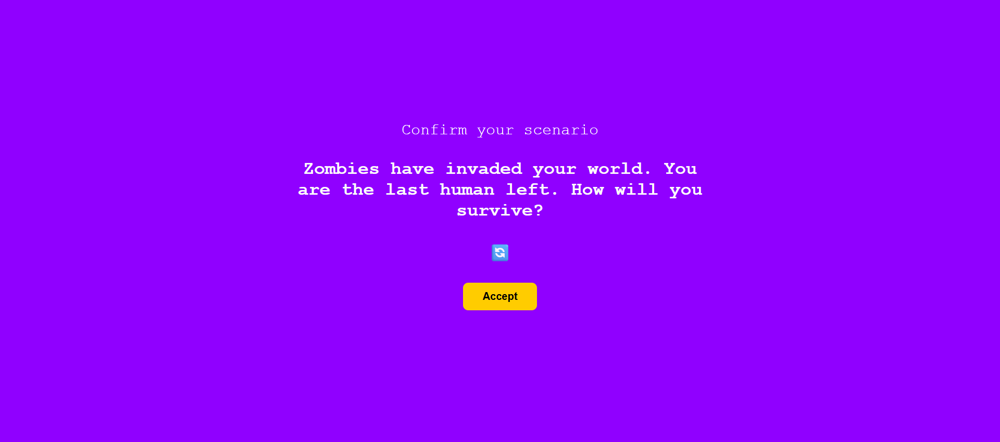
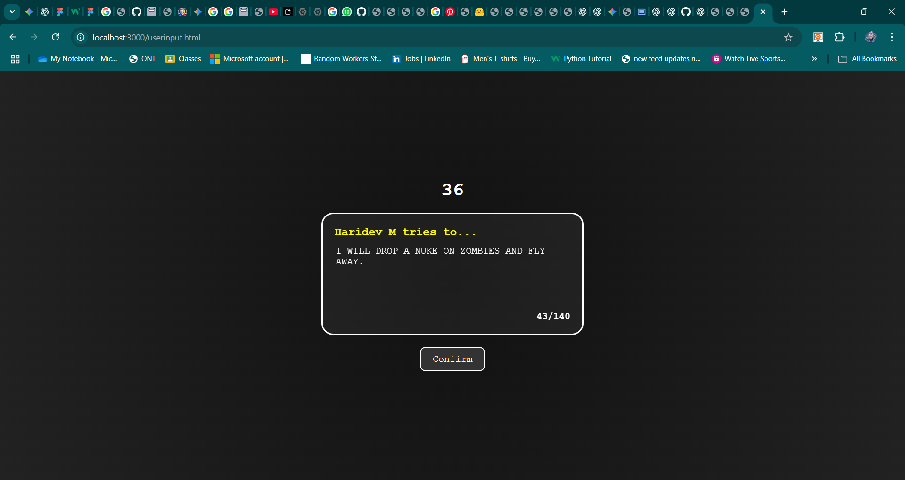
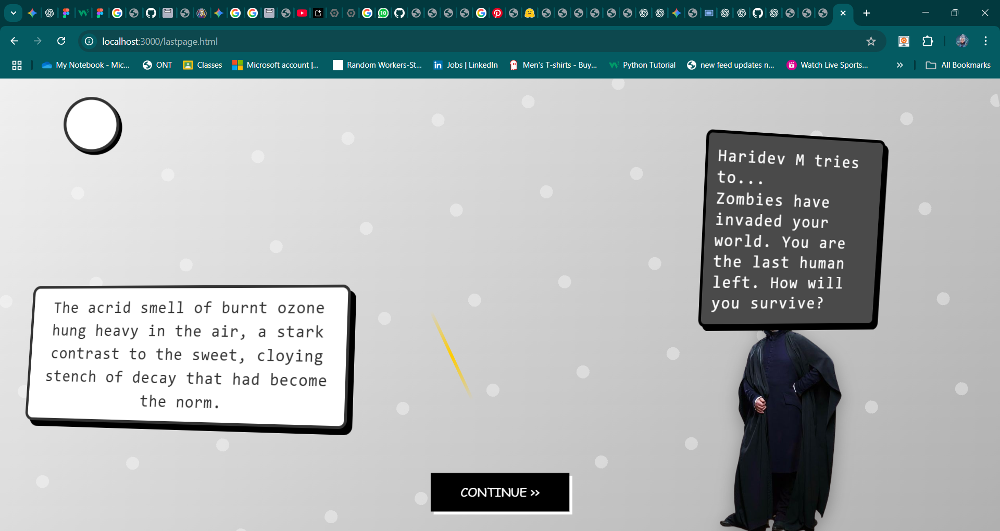

## 🎥 [Click here for demo video](https://drive.google.com/file/d/1L14v2f6YxA88pRD2_QB1OWRHeip5KZOY/view?usp=sharing "🔼 Google Drive -  Demo 🎥") 🎥


# അതിജീവനം 🎯

**A simple survival type game.**

---

## 🧑‍🤝‍🧑 Team Members

- **Team Lead**: Haridev M – RIT Kottayam  
- **Member 2**: Sanjay Nair – RIT Kottayam  

---

## 📌 Project Description

**അതിജീവനം** is an AI-powered interactive survival game that immerses players in a series of life-threatening scenarios—ranging from zombie outbreaks and natural disasters to wilderness accidents and sci-fi calamities.

Players must type out their survival strategy for each scenario. The game uses Google's Gemini API to evaluate their strategy based on logical reasoning, realism, and survival effectiveness, and responds with either **“Survived”** or **“Died”** along with a short explanation.

---

## ❓ The Problem (that doesn’t exist)

What if humanity had to rely on text-based survival plans in deadly situations… and an AI was the only judge of who lives or dies?

There’s clearly no shortage of disaster in the world—but there’s definitely a shortage of games that ask:  
**“Would you survive if the world turned into a zombie swamp overnight?”**

---

## 🛠️ The Solution (that nobody asked for)

We solved this very fictional, extremely unnecessary problem with **അതിജീവനം** — a totally over-engineered survival simulator where:

- You're dumped into insane situations (volcano eruptions, alien zoos, deserted islands)
- You explain how you’ll survive
- Google's Gemini AI decides if your plan is brilliant… or worthy of a Darwin Award
- If you die? At least it’s funny.

---

## 💻 Technical Details

### 🔧 Technologies/Components Used

#### 🖥️ For Software:

- **Languages**:  
  HTML, CSS, JavaScript (Vanilla), Python (Flask)

- **Frameworks**:  
  Flask (backend)

- **Libraries**:  
  `google-generativeai` (Gemini API Python SDK),  
  Fetch API (frontend)

- **Tools**:  
  VS Code, GitHub, Replit (optional hosting),  
  Google Cloud Console (for Gemini API access)

---

## ⚙️ Implementation

### 🧪 Installation (Software)

Make sure you have Python and `pip` installed.

# Screenshots








```bash
pip install flask
pip install google-generativeai
